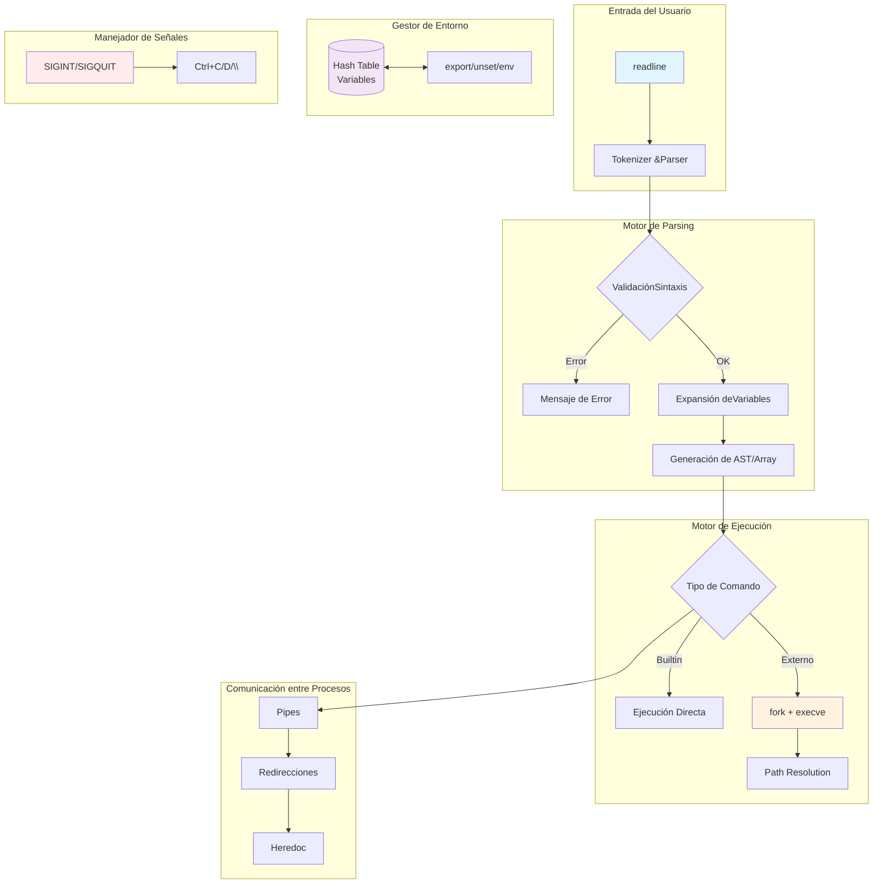

# Minishell


## Descripción

Implementación desde cero de una shell Unix minimalista que replica el comportamiento de bash, incluyendo gestión de procesos, redirecciones, pipes y expansión de variables. Proyecto del currículo de 42 Barcelona que demuestra comprensión profunda del funcionamiento interno de los sistemas Unix.

## Características Principales

- **Ejecución de comandos**: Comandos simples y encadenados con pipes (`|`)
- **Redirecciones**: Entrada (`<`), salida (`>`), append (`>>`) y heredoc (`<<`)
- **Builtins implementados**:
  - `echo` con opción `-n`
  - `cd` cambio de directorio
  - `pwd` directorio actual
  - `export` gestión de variables de entorno
  - `unset` eliminación de variables
  - `env` listado de entorno
  - `exit` salida de la shell
- **Expansión de variables**: Soporte para `$VAR` y `$?`
- **Manejo de señales**: `Ctrl+C`, `Ctrl+D`, `Ctrl+\`
- **Parser robusto**: Comillas simples y dobles correctamente anidadas
- **Historial de comandos**: Integración con readline

## Stack Tecnológico

| Componente | Tecnología |
|------------|------------|
| Lenguaje | C (C99) |
| Compilador | GCC con flags `-Wall -Wextra -Werror` |
| Librería externa | readline (GNU) |
| Librería propia | libft (reimplementación de libc) |
| Estructura de datos | Hash Table para entorno |
| IPC | Pipes Unix, descriptores de archivo |

## Decisiones Técnicas / Arquitectura

La arquitectura del proyecto se fundamenta en una **tabla hash personalizada** para la gestión eficiente de variables de entorno, evitando búsquedas lineales O(n) típicas de arrays simples. El parser implementa un **autómata de estados** para manejar comillas anidadas y expansión de variables, separando claramente las fases de tokenización y ejecución.

El manejo de procesos utiliza el patrón clásico `fork/exec/wait` con comunicación entre procesos padre-hijo mediante pipes. Las señales se gestionan diferenciando entre el proceso principal (`NORMAL`) y los procesos hijos (`CHILD`) para mantener el comportamiento esperado de una shell interactiva sin bloqueos ni zombies.

Se optó por una **librería propia (libft)** en lugar de libc estándar, demostrando dominio de funciones de bajo nivel como `malloc`, manipulación de strings y gestión de memoria.



## Getting Started

### Prerrequisitos

```bash
# Ubuntu/Debian
sudo apt update && sudo apt install build-essential libreadline-dev

# macOS
xcode-select --install
brew install readline
```

### Instalación y Ejecución

```bash
# Clonar el repositorio
git clone https://github.com/samuelhm/Minishell.git
cd Minishell

# Compilar (incluye libft automaticamente)
make

# Ejecutar
./minishell
```

### Comandos de Compilación

```bash
make          # Compila el proyecto completo
make clean    # Elimina archivos objeto
make fclean   # Elimina binarios y objetos
make re       # Recompila desde cero
```

### Ejemplos de Uso

```bash
minishell > echo "Hola Mundo"
Hola Mundo

minishell > ls -la | grep ".c" | wc -l
89

minishell > export MY_VAR="42 Barcelona"
minishell > echo $MY_VAR
42 Barcelona

minishell > cat << EOF
> linea 1
> linea 2
> EOF
linea 1
linea 2

minishell > echo "Status anterior: $?"
Status anterior: 0
```

## Estructura del Proyecto

```
Minishell/
├── inc/
│   ├── minishell.h     # Header principal
│   └── env.h           # Hash table para entorno
├── src/
│   ├── main.c          # Entry point
│   ├── minishell.c     # Inicialización y loop principal
│   ├── signal.c        # Manejo de señales
│   ├── blt/            # Builtins (echo, cd, pwd, etc.)
│   ├── env/            # Gestión de variables de entorno
│   ├── exec/           # Motor de ejecución
│   ├── parse/          # Parser y tokenizador
│   └── parse2/         # Parser avanzado
├── lib/
│   └── libft/          # Librería personalizada
└── Makefile
```

## Contacto

| Plataforma | Enlace |
|------------|--------|
| GitHub | [github.com/samuelhm](https://github.com/samuelhm) |
| LinkedIn | [linkedin.com/in/shurtado-m](https://www.linkedin.com/in/shurtado-m/) |

---

*Proyecto desarrollado como parte del currículo de 42 Barcelona, demostrando competencias en programación de sistemas, gestión de procesos Unix y arquitectura de software.*